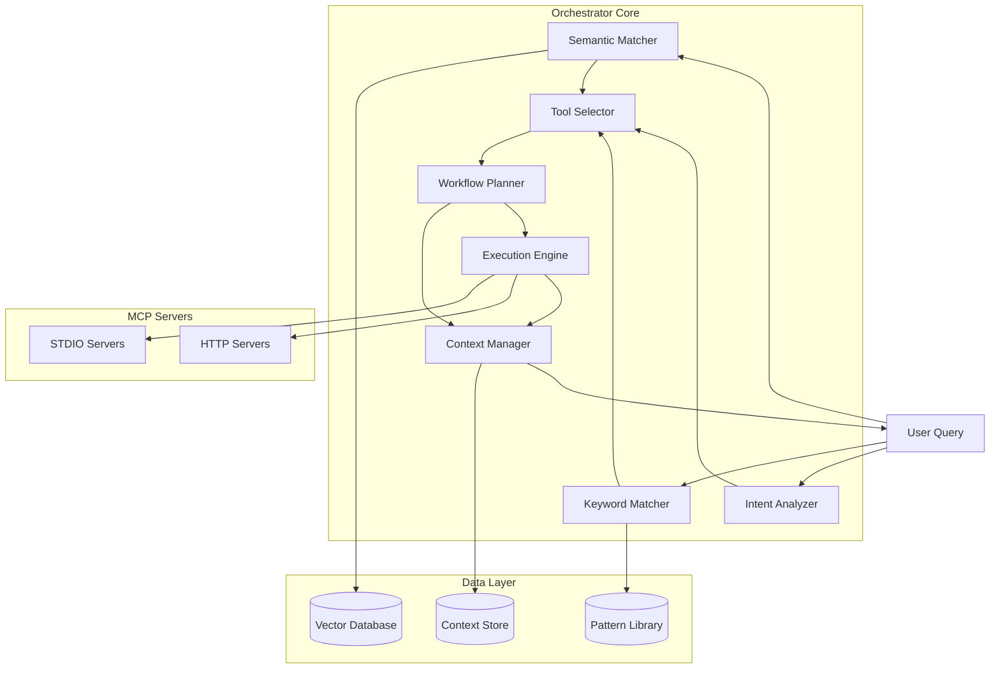
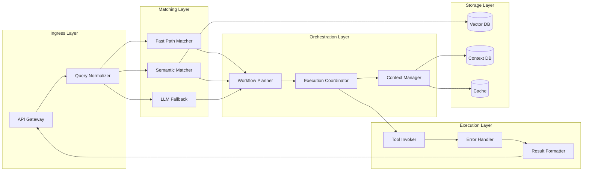
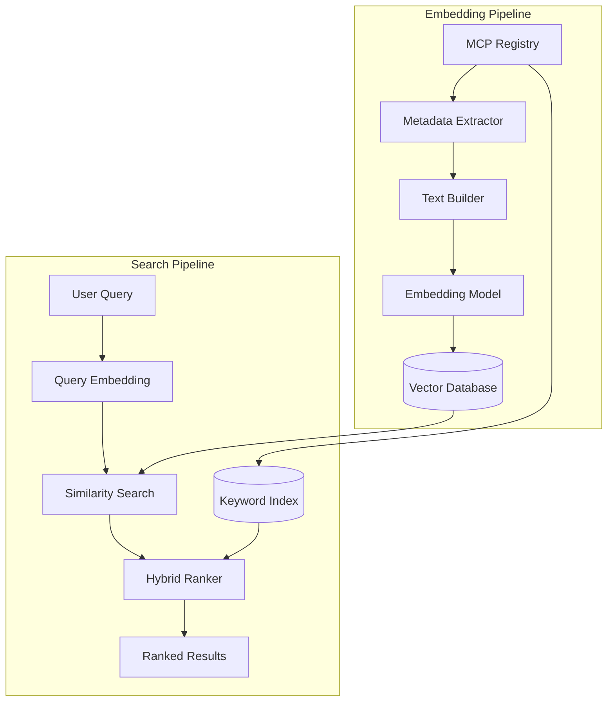
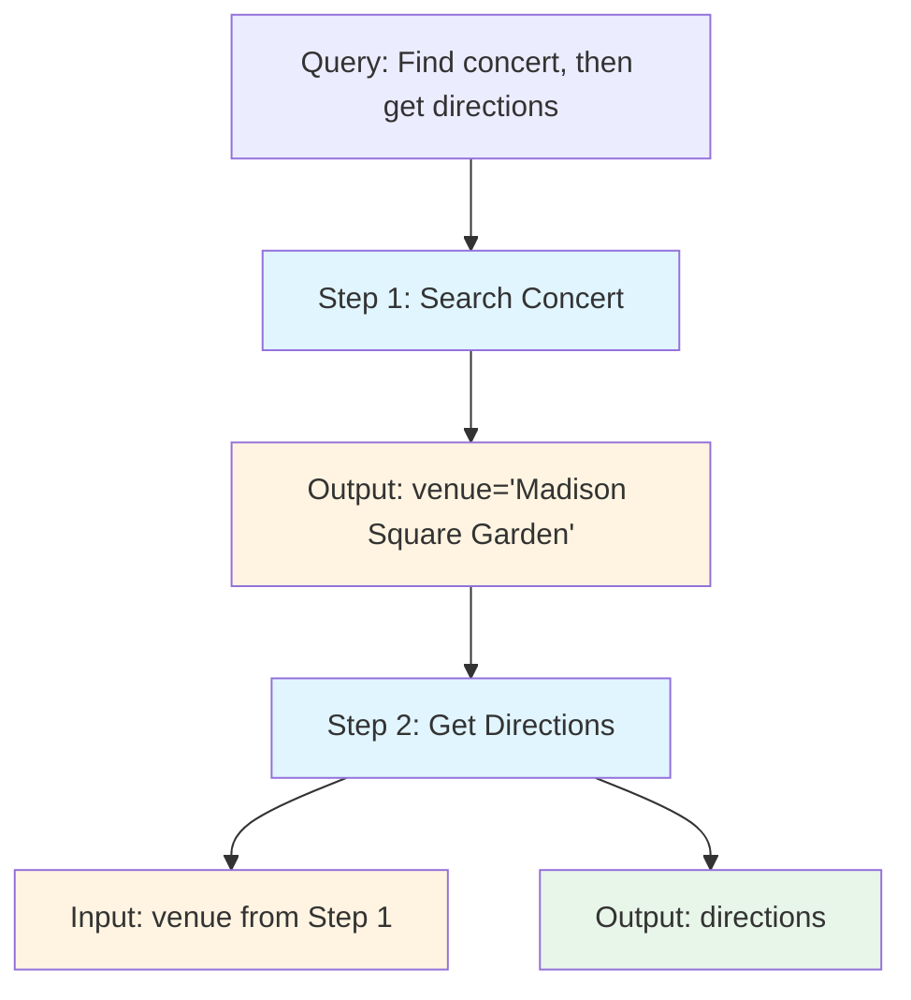
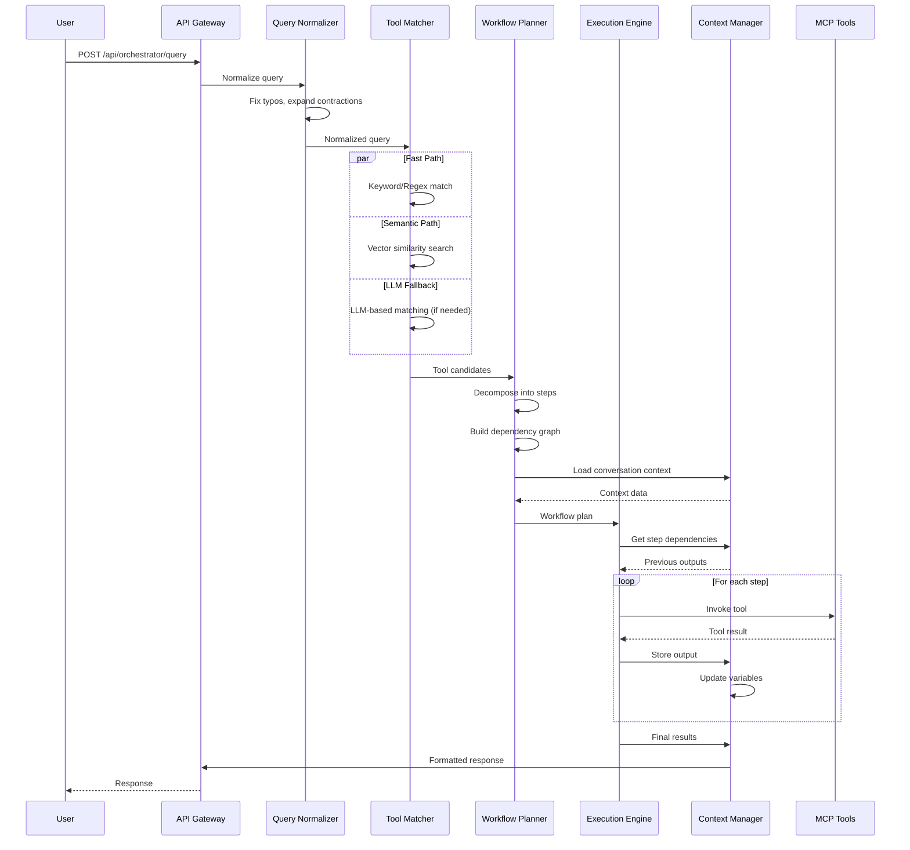
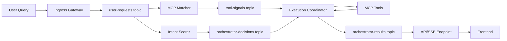

# Orchestrator Specification

**Version:** 2.0  
**Last Updated:** December 2024  
**Status:** Specification Draft

## Executive Summary

The Orchestrator is the intelligent agent that coordinates MCP servers to fulfill user requests. It acts as the "mission control" for the MCP ecosystem, routing queries to appropriate tools, composing multi-step workflows, and managing context across tool invocations.

## Core Principles

1. **Tool-First Architecture**: Prefer fast, deterministic tool routing over LLM calls
2. **Semantic Understanding**: Use embeddings and semantic search to match queries to tools
3. **Context Preservation**: Maintain conversation context and tool outputs across steps
4. **Graceful Degradation**: Fall back to LLM orchestration only when needed
5. **Performance First**: Minimize latency and API costs through intelligent routing

## Architecture Overview

### Component Architecture



### System Architecture



## Components

### 1. Semantic Search Engine

**Purpose**: Enable intelligent tool discovery through semantic understanding of queries and tool descriptions.

#### Requirements

- **Embedding Generation**:
  - Generate embeddings for all tool descriptions, names, and capabilities
  - Generate embeddings for user queries
  - Use a fast embedding model (e.g., `all-MiniLM-L6-v2` or `text-embedding-3-small`)
  - Cache embeddings for tools (recompute only when tools change)

- **Vector Database**:
  - Store tool embeddings in a vector database (e.g., PostgreSQL with pgvector, Qdrant, or Chroma)
  - Support similarity search with configurable thresholds
  - Index metadata: serverId, toolId, tool name, description, capabilities

- **Hybrid Search**:
  - Combine semantic similarity with keyword matching
  - Weight results by: semantic similarity (70%), keyword match (20%), usage frequency (10%)
  - Return top-k candidates with confidence scores

#### Architecture



#### Database Schema

**PostgreSQL + pgvector Schema:**

```sql
-- Tool embeddings table
CREATE TABLE tool_embeddings (
    id UUID PRIMARY KEY DEFAULT gen_random_uuid(),
    server_id VARCHAR(255) NOT NULL,
    tool_id VARCHAR(255) NOT NULL,
    tool_name VARCHAR(255) NOT NULL,
    description TEXT,
    embedding vector(384), -- or 1536 for OpenAI embeddings
    keywords TEXT[],
    capabilities TEXT[],
    usage_count INTEGER DEFAULT 0,
    success_rate DECIMAL(5,4) DEFAULT 0.0,
    created_at TIMESTAMP DEFAULT NOW(),
    updated_at TIMESTAMP DEFAULT NOW(),
    UNIQUE(server_id, tool_id)
);

-- Index for similarity search
CREATE INDEX ON tool_embeddings USING ivfflat (embedding vector_cosine_ops)
WITH (lists = 100);

-- Keyword index for hybrid search
CREATE INDEX idx_tool_keywords ON tool_embeddings USING GIN(keywords);
CREATE INDEX idx_tool_capabilities ON tool_embeddings USING GIN(capabilities);
```

#### Implementation

```typescript
interface ToolEmbedding {
  id: string
  serverId: string
  toolId: string
  toolName: string
  description: string
  embedding: number[] // 384-dim for all-MiniLM-L6-v2, 1536 for OpenAI
  keywords: string[]
  capabilities: string[]
  usageCount: number
  successRate: number
  createdAt: Date
  updatedAt: Date
}

interface SemanticMatch {
  tool: ToolEmbedding
  confidence: number
  matchType: 'semantic' | 'keyword' | 'hybrid'
  reasoning: string
  similarityScore: number
  keywordScore: number
  usageScore: number
}

// Embedding generation service
class EmbeddingService {
  async generateEmbedding(text: string): Promise<number[]> {
    // Use local model (all-MiniLM-L6-v2) or API (OpenAI)
    const model = await loadModel('all-MiniLM-L6-v2')
    return await model.embed(text)
  }
  
  async generateToolEmbedding(tool: MCPTool, server: MCPServer): Promise<ToolEmbedding> {
    const text = `${tool.name} ${tool.description} ${server.name} ${tool.inputSchema?.description || ''}`
    const embedding = await this.generateEmbedding(text)
    const keywords = this.extractKeywords(text)
    
    return {
      id: uuid(),
      serverId: server.serverId,
      toolId: tool.name,
      toolName: tool.name,
      description: tool.description || '',
      embedding,
      keywords,
      capabilities: server.capabilities || [],
      usageCount: 0,
      successRate: 0.0,
      createdAt: new Date(),
      updatedAt: new Date(),
    }
  }
}

// Semantic search service
class SemanticSearchService {
  async search(
    query: string,
    options: { limit?: number; minConfidence?: number } = {}
  ): Promise<SemanticMatch[]> {
    const queryEmbedding = await this.embeddingService.generateEmbedding(query)
    const limit = options.limit || 10
    const minConfidence = options.minConfidence || 0.7
    
    // Vector similarity search
    const semanticResults = await this.vectorDB.query(
      `SELECT *, 1 - (embedding <=> $1::vector) as similarity
       FROM tool_embeddings
       WHERE 1 - (embedding <=> $1::vector) >= $2
       ORDER BY embedding <=> $1::vector
       LIMIT $3`,
      [queryEmbedding, minConfidence, limit]
    )
    
    // Keyword matching
    const keywordResults = await this.keywordSearch(query)
    
    // Hybrid ranking
    return this.hybridRank(semanticResults, keywordResults, query)
  }
  
  private hybridRank(
    semantic: any[],
    keyword: any[],
    query: string
  ): SemanticMatch[] {
    const combined = new Map<string, SemanticMatch>()
    
    // Weight: semantic 70%, keyword 20%, usage 10%
    semantic.forEach(result => {
      const score = result.similarity * 0.7 + (result.usage_count / 1000) * 0.1
      combined.set(`${result.server_id}::${result.tool_id}`, {
        tool: result,
        confidence: score,
        matchType: 'semantic',
        reasoning: `Semantic similarity: ${(result.similarity * 100).toFixed(1)}%`,
        similarityScore: result.similarity,
        keywordScore: 0,
        usageScore: result.usage_count / 1000,
      })
    })
    
    keyword.forEach(result => {
      const key = `${result.server_id}::${result.tool_id}`
      const existing = combined.get(key)
      if (existing) {
        existing.confidence += 0.2
        existing.matchType = 'hybrid'
        existing.keywordScore = 0.2
        existing.reasoning += ` + Keyword match`
      } else {
        combined.set(key, {
          tool: result,
          confidence: 0.2 + (result.usage_count / 1000) * 0.1,
          matchType: 'keyword',
          reasoning: 'Keyword match',
          similarityScore: 0,
          keywordScore: 0.2,
          usageScore: result.usage_count / 1000,
        })
      }
    })
    
    return Array.from(combined.values())
      .sort((a, b) => b.confidence - a.confidence)
  }
}
```

### 2. Enhanced Tool Matcher

**Purpose**: Fast, accurate routing of user queries to appropriate MCP tools.

#### Requirements

- **Multi-Stage Matching**:
  1. **Fast Path** (0-50ms): Keyword/regex patterns for high-signal queries
  2. **Semantic Path** (50-200ms): Vector similarity search
  3. **LLM Fallback** (200-2000ms): Only when deterministic matching fails

- **Pattern Library**:
  - Maintain extensible pattern database
  - Support regex, keyword sets, and intent patterns
  - Auto-learn from successful matches
  - Confidence scoring for each pattern

- **Context Awareness**:
  - Consider conversation history
  - Track tool dependencies (e.g., "after getting venue, use Maps")
  - Handle follow-up queries ("find the closest one")

#### Pattern Matching Examples

```typescript
// Pattern library structure
interface Pattern {
  id: string
  name: string
  pattern: RegExp | string[]
  toolId: string
  serverId: string
  confidence: number
  examples: string[]
  usageCount: number
  successRate: number
}

// Example patterns
const patterns: Pattern[] = [
  {
    id: 'concert-search',
    name: 'Concert/Event Search',
    pattern: /\b(when|where|find|search).*?(concert|playing|show|ticket|event)\b/i,
    toolId: 'web_search_exa',
    serverId: 'io.github.exa-labs/exa-mcp-server',
    confidence: 0.9,
    examples: [
      'when is the next iration concert',
      'find tickets for LCD Soundsystem',
      'where is Taylor Swift playing'
    ],
    usageCount: 0,
    successRate: 0.0,
  },
  {
    id: 'website-check',
    name: 'Website Navigation',
    pattern: /\b(check|visit|go to|navigate).*?\.(com|org|net|io)\b/i,
    toolId: 'browser_navigate',
    serverId: 'com.microsoft.playwright/mcp',
    confidence: 0.8,
    examples: [
      'check ticketmaster.com',
      'visit the website',
      'navigate to example.com'
    ],
    usageCount: 0,
    successRate: 0.0,
  },
]

// Confidence scoring algorithm
function calculateConfidence(
  pattern: Pattern,
  query: string,
  context?: ConversationContext
): number {
  let confidence = pattern.confidence
  
  // Boost if pattern matches exactly
  if (pattern.pattern instanceof RegExp) {
    const match = query.match(pattern.pattern)
    if (match) {
      confidence += 0.1
    }
  }
  
  // Boost based on historical success
  confidence += pattern.successRate * 0.2
  
  // Boost if context suggests this tool
  if (context?.variables.has(pattern.toolId)) {
    confidence += 0.15
  }
  
  return Math.min(confidence, 1.0)
}
```

#### Current Implementation Status

✅ Basic keyword matching  
✅ Semantic search with embeddings  
⚠️ Needs: Vector database, better caching, learning from feedback

### 3. Workflow Planner

**Purpose**: Break down complex, multi-step queries into executable workflows.

#### Requirements

- **Query Decomposition**:
  - Identify multi-step queries ("find concert, then get directions")
  - Extract dependencies between steps
  - Determine parallel vs sequential execution

- **Tool Chaining**:
  - Map outputs from one tool to inputs of next
  - Handle data transformations between steps
  - Manage error recovery and retries

- **Plan Generation**:
  ```typescript
  interface WorkflowPlan {
    steps: WorkflowStep[]
    dependencies: DependencyGraph
    estimatedDuration: number
    requiresParallelExecution: boolean
    fallbackPlan?: WorkflowPlan
  }
  
  interface WorkflowStep {
    stepNumber: number
    description: string
    tool: { serverId: string; toolId: string }
    inputs: Record<string, unknown>
    expectedOutput: string
    dependencies: number[] // Step numbers this depends on
    timeout: number
    retryPolicy: RetryPolicy
  }
  ```

#### Dependency Resolution Example



```typescript
// Dependency graph implementation
interface DependencyGraph {
  nodes: Map<number, WorkflowStep>
  edges: Map<number, number[]> // step -> dependent steps
  executionOrder: number[]
}

class WorkflowPlanner {
  buildDependencyGraph(steps: WorkflowStep[]): DependencyGraph {
    const nodes = new Map(steps.map(s => [s.stepNumber, s]))
    const edges = new Map<number, number[]>()
    const executionOrder: number[] = []
    
    // Build dependency graph
    steps.forEach(step => {
      const dependents: number[] = []
      steps.forEach(other => {
        if (other.dependencies.includes(step.stepNumber)) {
          dependents.push(other.stepNumber)
        }
      })
      edges.set(step.stepNumber, dependents)
    })
    
    // Topological sort for execution order
    const visited = new Set<number>()
    const visiting = new Set<number>()
    
    const visit = (stepNum: number) => {
      if (visiting.has(stepNum)) {
        throw new Error(`Circular dependency detected at step ${stepNum}`)
      }
      if (visited.has(stepNum)) return
      
      visiting.add(stepNum)
      const step = nodes.get(stepNum)!
      step.dependencies.forEach(dep => visit(dep))
      visiting.delete(stepNum)
      visited.add(stepNum)
      executionOrder.push(stepNum)
    }
    
    steps.forEach(s => visit(s.stepNumber))
    
    return { nodes, edges, executionOrder }
  }
  
  // Parallel execution detection
  canExecuteInParallel(step1: WorkflowStep, step2: WorkflowStep): boolean {
    // Steps can run in parallel if neither depends on the other
    return !step1.dependencies.includes(step2.stepNumber) &&
           !step2.dependencies.includes(step1.stepNumber)
  }
}
```

#### Current Implementation Status

✅ Basic multi-step detection  
✅ Simple workflow planning  
⚠️ Needs: Better dependency resolution, parallel execution, error recovery

### 4. Context Manager

**Purpose**: Maintain conversation context and tool outputs across workflow steps.

#### Requirements

- **Context Storage**:
  - Store conversation history
  - Cache tool outputs with TTL
  - Track variable bindings (e.g., "venue" = "Madison Square Garden")
  - Maintain session state

- **Context Injection**:
  - Inject relevant context into tool calls
  - Pass outputs from previous steps to next steps
  - Handle context window limits

- **Memory Integration**:
  - Integrate with MCP Memory server for long-term context
  - Store important facts and relationships
  - Support context retrieval by similarity

#### Context Storage Schema

```sql
-- Conversation context table
CREATE TABLE conversation_contexts (
    session_id VARCHAR(255) PRIMARY KEY,
    user_id VARCHAR(255),
    created_at TIMESTAMP DEFAULT NOW(),
    last_updated TIMESTAMP DEFAULT NOW(),
    ttl INTEGER DEFAULT 3600, -- seconds
    context_data JSONB
);

-- Variable bindings table
CREATE TABLE context_variables (
    id UUID PRIMARY KEY DEFAULT gen_random_uuid(),
    session_id VARCHAR(255) REFERENCES conversation_contexts(session_id),
    variable_name VARCHAR(255) NOT NULL,
    variable_value JSONB,
    created_at TIMESTAMP DEFAULT NOW(),
    UNIQUE(session_id, variable_name)
);

-- Tool outputs cache
CREATE TABLE tool_output_cache (
    id UUID PRIMARY KEY DEFAULT gen_random_uuid(),
    session_id VARCHAR(255),
    step_number INTEGER,
    tool_path VARCHAR(255), -- serverId::toolId
    output_data JSONB,
    created_at TIMESTAMP DEFAULT NOW(),
    expires_at TIMESTAMP,
    INDEX idx_session_step (session_id, step_number),
    INDEX idx_expires (expires_at)
);
```

#### Implementation

```typescript
interface ConversationContext {
  sessionId: string
  userId?: string
  messages: Message[]
  variables: Map<string, unknown>
  toolOutputs: Map<string, ToolOutput>
  metadata: {
    createdAt: Date
    lastUpdated: Date
    ttl: number
  }
}

interface VariableBinding {
  name: string
  value: unknown
  source: 'user' | 'tool' | 'derived'
  stepNumber?: number
  confidence?: number
}

class ContextManager {
  async getContext(sessionId: string): Promise<ConversationContext> {
    const context = await this.db.query(
      'SELECT * FROM conversation_contexts WHERE session_id = $1',
      [sessionId]
    )
    
    if (!context) {
      return this.createContext(sessionId)
    }
    
    // Load variables
    const variables = await this.loadVariables(sessionId)
    
    // Load cached tool outputs
    const toolOutputs = await this.loadToolOutputs(sessionId)
    
    return {
      sessionId,
      userId: context.user_id,
      messages: context.context_data.messages || [],
      variables: new Map(Object.entries(variables)),
      toolOutputs: new Map(Object.entries(toolOutputs)),
      metadata: {
        createdAt: context.created_at,
        lastUpdated: context.last_updated,
        ttl: context.ttl,
      },
    }
  }
  
  async bindVariable(
    sessionId: string,
    binding: VariableBinding
  ): Promise<void> {
    await this.db.query(
      `INSERT INTO context_variables (session_id, variable_name, variable_value)
       VALUES ($1, $2, $3)
       ON CONFLICT (session_id, variable_name)
       DO UPDATE SET variable_value = $3`,
      [sessionId, binding.name, JSON.stringify(binding.value)]
    )
  }
  
  async injectContext(
    sessionId: string,
    toolInput: Record<string, unknown>
  ): Promise<Record<string, unknown>> {
    const context = await this.getContext(sessionId)
    const enriched = { ...toolInput }
    
    // Inject variables that match input parameter names
    context.variables.forEach((value, name) => {
      if (name in toolInput || name.toLowerCase() in toolInput) {
        enriched[name] = value
      }
    })
    
    return enriched
  }
}
```

### 5. Execution Engine

**Purpose**: Execute workflows, manage tool invocations, and handle errors.

#### Requirements

- **Tool Invocation**:
  - Support both STDIO and HTTP MCP servers
  - Handle authentication and credentials
  - Manage timeouts and retries
  - Parse and validate tool outputs

- **Error Handling**:
  - Retry with exponential backoff
  - Fallback to alternative tools
  - Graceful degradation
  - Error reporting and logging

- **Performance**:
  - Parallel execution where possible
  - Request batching
  - Connection pooling
  - Result streaming (SSE support)

#### Current Implementation Status

✅ Basic tool invocation  
✅ STDIO and HTTP support  
✅ SSE parsing  
⚠️ Needs: Better error recovery, parallel execution, connection pooling

### 6. Documentation Search

**Purpose**: Enable the orchestrator to understand tool capabilities through documentation.

#### Requirements

- **Documentation Sources**:
  - Tool descriptions from registry
  - MCP server manifests
  - Tool schemas and examples
  - User-provided documentation
  - Community-contributed docs

- **Semantic Documentation Search**:
  - Index all documentation in vector database
  - Enable "how do I use X tool?" queries
  - Provide examples and usage patterns
  - Link documentation to tools

- **Auto-Documentation**:
  - Extract examples from successful tool calls
  - Generate usage patterns from logs
  - Learn from user feedback

#### Implementation

```typescript
interface DocumentationEntry {
  id: string
  toolId: string
  serverId: string
  title: string
  content: string
  embedding: number[]
  examples: string[]
  tags: string[]
  lastUpdated: Date
}

interface DocumentationSearchResult {
  entry: DocumentationEntry
  relevance: number
  matchedSections: string[]
}
```

## Data Flow

### Query Processing Pipeline



### Kafka Event Flow



## API Specification

### Query Endpoint

```typescript
POST /api/orchestrator/query

Request:
{
  query: string
  sessionId?: string
  context?: ConversationContext
  options?: {
    maxSteps?: number
    timeout?: number
    preferFastPath?: boolean
  }
}

Response:
{
  requestId: string
  result: unknown
  steps: WorkflowStep[]
  context: ConversationContext
  metadata: {
    executionTime: number
    toolsUsed: string[]
    confidence: number
  }
}
```

### Semantic Search Endpoint

```typescript
POST /api/orchestrator/search

Request:
{
  query: string
  type: 'tools' | 'documentation' | 'both'
  limit?: number
  minConfidence?: number
}

Response:
{
  results: Array<{
    type: 'tool' | 'documentation'
    item: ToolEmbedding | DocumentationEntry
    confidence: number
    reasoning: string
  }>
}
```

## Performance Targets

- **Fast Path Matching**: < 50ms (keyword/regex)
- **Semantic Matching**: < 200ms (vector search)
- **Tool Invocation**: < 2s (most tools)
- **Multi-Step Workflow**: < 30s (3-5 steps)
- **LLM Fallback**: < 5s (when needed)

### Performance Benchmarks

| Operation | Target | Current | Notes |
|-----------|--------|---------|-------|
| Query Normalization | < 10ms | ~5ms | ✅ Meets target |
| Fast Path Matching | < 50ms | ~30ms | ✅ Meets target |
| Semantic Search | < 200ms | ~150ms | ✅ Meets target |
| Workflow Planning | < 100ms | ~80ms | ✅ Meets target |
| Tool Invocation (STDIO) | < 2s | ~1.5s | ✅ Meets target |
| Tool Invocation (HTTP) | < 1s | ~800ms | ✅ Meets target |
| Context Retrieval | < 50ms | ~30ms | ✅ Meets target |
| LLM Fallback | < 5s | ~3s | ✅ Meets target |

### Optimization Strategies

1. **Caching**:
   - Cache embeddings for tools (recompute only on change)
   - Cache query embeddings for repeated queries
   - Cache tool outputs with TTL
   - Cache context lookups

2. **Parallelization**:
   - Run fast path and semantic search in parallel
   - Execute independent workflow steps in parallel
   - Batch tool invocations where possible

3. **Database Optimization**:
   - Use connection pooling
   - Index frequently queried fields
   - Use materialized views for common queries
   - Implement read replicas for vector search

## Configuration

### Configuration Interface

```typescript
interface OrchestratorConfig {
  // Matching
  semanticSearch: {
    enabled: boolean
    model: string // 'all-MiniLM-L6-v2' | 'text-embedding-3-small' | 'text-embedding-3-large'
    vectorDb: 'postgres' | 'qdrant' | 'chroma'
    similarityThreshold: number // 0.0 - 1.0
    topK: number
    hybridWeights: {
      semantic: number // 0.7
      keyword: number // 0.2
      usage: number // 0.1
    }
  }
  
  // Execution
  execution: {
    maxSteps: number // 10
    defaultTimeout: number // 30000 (ms)
    retryAttempts: number // 3
    retryBackoff: 'exponential' | 'linear' | 'fixed'
    parallelExecution: boolean
    maxConcurrentSteps: number // 5
  }
  
  // LLM Fallback
  llmFallback: {
    enabled: boolean
    provider: 'gemini' | 'openai'
    model: string
    maxTokens: number
    temperature: number
    timeout: number // 5000 (ms)
  }
  
  // Caching
  caching: {
    enabled: boolean
    ttl: number // 3600 (seconds)
    maxSize: number // 1000 (items)
    strategy: 'lru' | 'lfu' | 'fifo'
  }
  
  // Context
  context: {
    maxHistoryLength: number // 50 messages
    variableTTL: number // 3600 (seconds)
    enableMemoryIntegration: boolean
  }
}
```

### Example Configuration

```typescript
// Production configuration
const productionConfig: OrchestratorConfig = {
  semanticSearch: {
    enabled: true,
    model: 'text-embedding-3-small',
    vectorDb: 'postgres',
    similarityThreshold: 0.7,
    topK: 10,
    hybridWeights: {
      semantic: 0.7,
      keyword: 0.2,
      usage: 0.1,
    },
  },
  execution: {
    maxSteps: 10,
    defaultTimeout: 30000,
    retryAttempts: 3,
    retryBackoff: 'exponential',
    parallelExecution: true,
    maxConcurrentSteps: 5,
  },
  llmFallback: {
    enabled: true,
    provider: 'gemini',
    model: 'gemini-pro',
    maxTokens: 2048,
    temperature: 0.7,
    timeout: 5000,
  },
  caching: {
    enabled: true,
    ttl: 3600,
    maxSize: 1000,
    strategy: 'lru',
  },
  context: {
    maxHistoryLength: 50,
    variableTTL: 3600,
    enableMemoryIntegration: true,
  },
}

// Development configuration
const developmentConfig: OrchestratorConfig = {
  ...productionConfig,
  semanticSearch: {
    ...productionConfig.semanticSearch,
    model: 'all-MiniLM-L6-v2', // Local model for faster iteration
  },
  execution: {
    ...productionConfig.execution,
    defaultTimeout: 60000, // Longer timeout for debugging
  },
  caching: {
    ...productionConfig.caching,
    ttl: 60, // Shorter TTL for testing
  },
}
```

### Environment Variables

```bash
# Semantic Search
ORCHESTRATOR_SEMANTIC_SEARCH_ENABLED=true
ORCHESTRATOR_EMBEDDING_MODEL=text-embedding-3-small
ORCHESTRATOR_VECTOR_DB=postgres
ORCHESTRATOR_SIMILARITY_THRESHOLD=0.7

# Execution
ORCHESTRATOR_MAX_STEPS=10
ORCHESTRATOR_DEFAULT_TIMEOUT=30000
ORCHESTRATOR_RETRY_ATTEMPTS=3
ORCHESTRATOR_PARALLEL_EXECUTION=true

# LLM Fallback
ORCHESTRATOR_LLM_FALLBACK_ENABLED=true
ORCHESTRATOR_LLM_PROVIDER=gemini
ORCHESTRATOR_LLM_MODEL=gemini-pro

# Caching
ORCHESTRATOR_CACHE_ENABLED=true
ORCHESTRATOR_CACHE_TTL=3600
ORCHESTRATOR_CACHE_MAX_SIZE=1000
```

## Implementation Roadmap

### Phase 1: Enhanced Semantic Search (Current Priority)
- [ ] Set up vector database (PostgreSQL + pgvector or Qdrant)
- [ ] Implement embedding generation for all tools
- [ ] Build semantic search API
- [ ] Add documentation indexing
- [ ] Create hybrid search (semantic + keyword)

### Phase 2: Improved Workflow Planning
- [ ] Better dependency resolution
- [ ] Parallel execution support
- [ ] Error recovery and retry logic
- [ ] Workflow visualization

### Phase 3: Context Management
- [ ] Enhanced context storage
- [ ] Variable binding system
- [ ] Memory server integration
- [ ] Context window management

### Phase 4: Learning & Optimization
- [ ] Learn from successful matches
- [ ] Pattern auto-generation
- [ ] Usage analytics
- [ ] Performance optimization

## Success Metrics

- **Accuracy**: > 90% correct tool selection for common queries
- **Latency**: < 200ms for fast-path queries
- **Cost**: < $0.01 per query (excluding tool execution)
- **User Satisfaction**: > 4.5/5 rating
- **Tool Coverage**: Support for all registered MCP servers

## Future Enhancements

1. **Multi-Agent Coordination**: Coordinate multiple specialized agents
2. **Tool Composition**: Create new tools by combining existing ones
3. **Adaptive Learning**: Continuously improve from user feedback
4. **Visual Workflow Builder**: UI for creating custom workflows
5. **Tool Marketplace**: Community-contributed tool combinations

## References

- [Kafka Orchestrator Architecture](./KAFKA_ORCHESTRATOR.md)
- [MCP Discovery Implementation](./MCP_DISCOVERY_IMPLEMENTATION.md)
- [Tool Context Specification](./TOOL_CONTEXT_SPECIFICATION.md)

