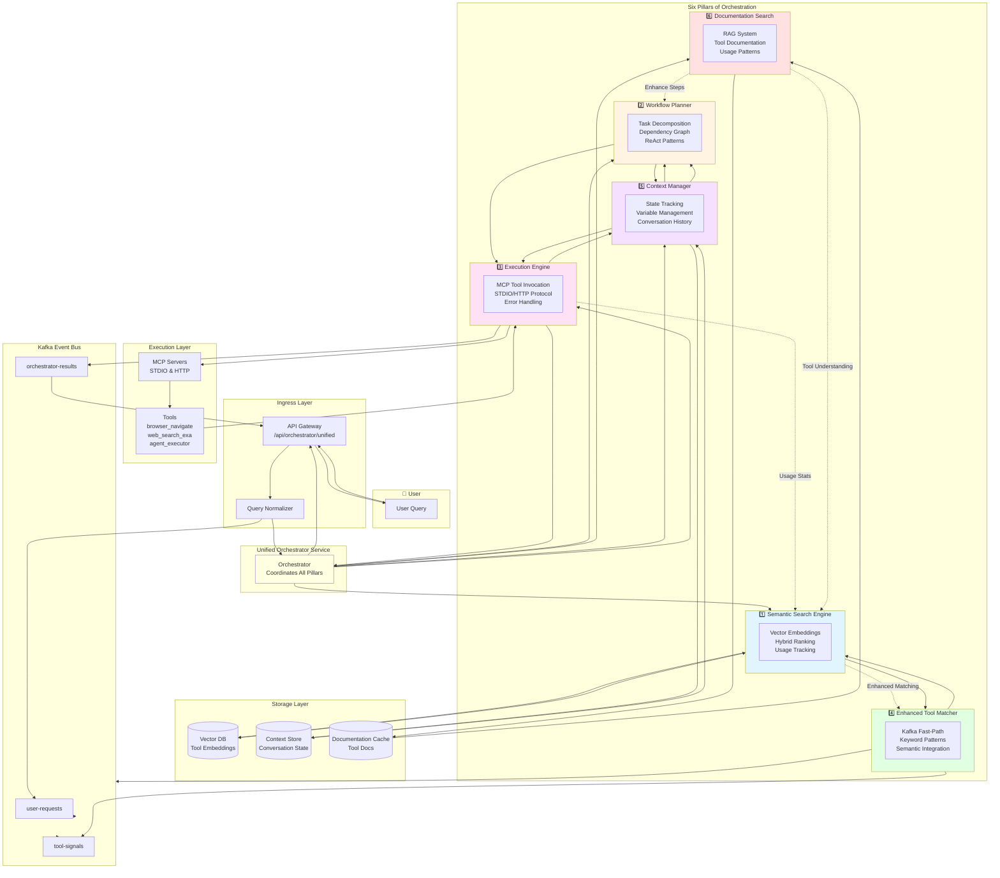
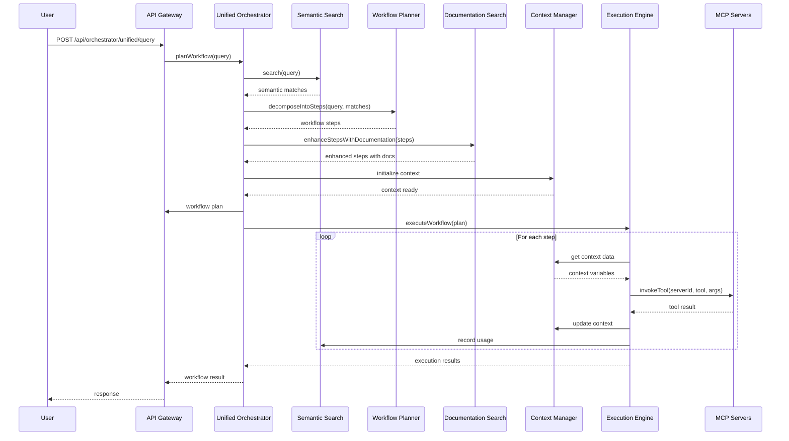
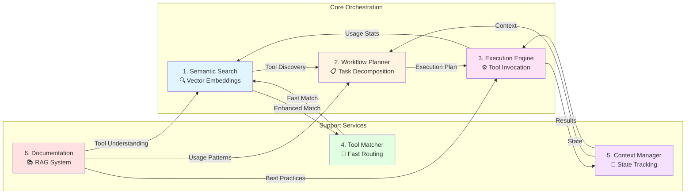
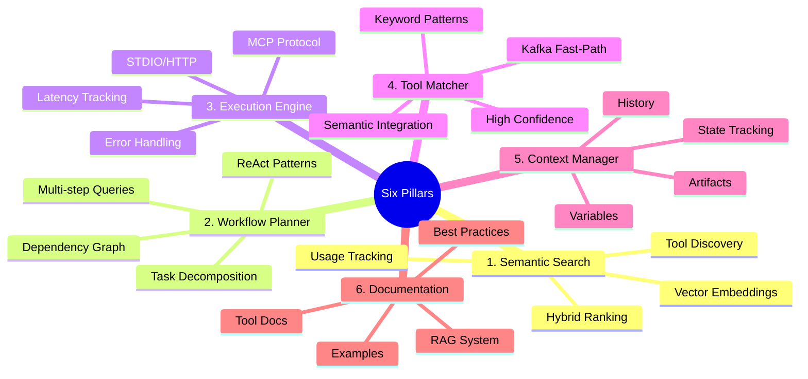

# Six Pillars of Orchestration - Architecture Diagram

## Complete System Architecture

```mermaid
flowchart TB
    subgraph User["👤 User"]
        Query["User Query"]
    end

    subgraph Ingress["Ingress Layer"]
        API["API Gateway<br/>/api/orchestrator/unified"]
        Normalizer["Query Normalizer"]
    end

    subgraph Pillars["Six Pillars of Orchestration"]
        direction TB
        
        subgraph P1["1️⃣ Semantic Search Engine"]
            SSE["Vector Embeddings<br/>Hybrid Ranking<br/>Usage Tracking"]
        end
        
        subgraph P2["2️⃣ Workflow Planner"]
            WP["Task Decomposition<br/>Dependency Graph<br/>ReAct Patterns"]
        end
        
        subgraph P3["3️⃣ Execution Engine"]
            EE["MCP Tool Invocation<br/>STDIO/HTTP Protocol<br/>Error Handling"]
        end
        
        subgraph P4["4️⃣ Enhanced Tool Matcher"]
            ETM["Kafka Fast-Path<br/>Keyword Patterns<br/>Semantic Integration"]
        end
        
        subgraph P5["5️⃣ Context Manager"]
            CM["State Tracking<br/>Variable Management<br/>Conversation History"]
        end
        
        subgraph P6["6️⃣ Documentation Search"]
            DS["RAG System<br/>Tool Documentation<br/>Usage Patterns"]
        end
    end

    subgraph Unified["Unified Orchestrator Service"]
        UO["Orchestrator<br/>Coordinates All Pillars"]
    end

    subgraph Storage["Storage Layer"]
        VectorDB[("Vector DB<br/>Tool Embeddings")]
        ContextDB[("Context Store<br/>Conversation State")]
        DocCache[("Documentation Cache<br/>Tool Docs")]
    end

    subgraph Execution["Execution Layer"]
        MCP["MCP Servers<br/>STDIO & HTTP"]
        Tools["Tools<br/>browser_navigate<br/>web_search_exa<br/>agent_executor"]
    end

    subgraph Kafka["Kafka Event Bus"]
        UserReq["user-requests"]
        ToolSig["tool-signals"]
        Results["orchestrator-results"]
    end

    %% User Flow
    Query --> API
    API --> Normalizer
    Normalizer --> UO

    %% Unified Orchestrator coordinates pillars
    UO --> P1
    UO --> P2
    UO --> P6
    UO --> P5
    UO --> P3

    %% Pillar 1: Semantic Search
    P1 --> VectorDB
    VectorDB --> P1
    P1 -.->|"Enhanced Matching"| P4

    %% Pillar 2: Workflow Planner
    P2 --> P5
    P2 --> P3
    P5 --> P2

    %% Pillar 3: Execution Engine
    P3 --> MCP
    MCP --> Tools
    Tools --> P3
    P3 --> P5
    P3 -.->|"Usage Stats"| P1

    %% Pillar 4: Enhanced Tool Matcher
    P4 --> Kafka
    Kafka --> UserReq
    Kafka --> ToolSig
    P4 --> P1
    P1 --> P4

    %% Pillar 5: Context Manager
    P5 --> ContextDB
    ContextDB --> P5
    P5 --> P3
    P5 --> P2

    %% Pillar 6: Documentation Search
    P6 --> DocCache
    DocCache --> P6
    P6 -.->|"Enhance Steps"| P2
    P6 -.->|"Tool Understanding"| P1

    %% Kafka Flow
    Normalizer --> UserReq
    P4 --> ToolSig
    P3 --> Results
    Results --> API

    %% Response Flow
    P3 --> UO
    UO --> API
    API --> Query

    style P1 fill:#e1f5ff
    style P2 fill:#fff4e1
    style P3 fill:#ffe1f5
    style P4 fill:#e1ffe1
    style P5 fill:#f5e1ff
    style P6 fill:#ffe1e1
    style UO fill:#ffffe1
```

## Data Flow Sequence

```mermaid
sequenceDiagram
    participant User
    participant API as API Gateway
    participant UO as Unified Orchestrator
    participant SSE as Semantic Search
    participant WP as Workflow Planner
    participant DS as Documentation Search
    participant CM as Context Manager
    participant EE as Execution Engine
    participant MCP as MCP Servers

    User->>API: POST /api/orchestrator/unified/query
    API->>UO: planWorkflow(query)
    
    UO->>SSE: search(query)
    SSE-->>UO: semantic matches
    
    UO->>WP: decomposeIntoSteps(query, matches)
    WP-->>UO: workflow steps
    
    UO->>DS: enhanceStepsWithDocumentation(steps)
    DS-->>UO: enhanced steps with docs
    
    UO->>CM: initialize context
    CM-->>UO: context ready
    
    UO->>API: workflow plan
    
    UO->>EE: executeWorkflow(plan)
    
    loop For each step
        EE->>CM: get context data
        CM-->>EE: context variables
        
        EE->>MCP: invokeTool(serverId, tool, args)
        MCP-->>EE: tool result
        
        EE->>CM: update context
        EE->>SSE: record usage
    end
    
    EE-->>UO: execution results
    UO-->>API: workflow result
    API-->>User: response
```

## Pillar Interactions

```mermaid
graph LR
    subgraph Core["Core Orchestration"]
        SSE["1. Semantic Search<br/>🔍 Vector Embeddings"]
        WP["2. Workflow Planner<br/>📋 Task Decomposition"]
        EE["3. Execution Engine<br/>⚙️ Tool Invocation"]
    end

    subgraph Support["Support Services"]
        ETM["4. Tool Matcher<br/>🎯 Fast Routing"]
        CM["5. Context Manager<br/>💾 State Tracking"]
        DS["6. Documentation<br/>📚 RAG System"]
    end

    SSE -->|"Tool Discovery"| WP
    WP -->|"Execution Plan"| EE
    EE -->|"Results"| CM
    CM -->|"Context"| WP
    
    ETM -->|"Fast Match"| SSE
    SSE -->|"Enhanced Match"| ETM
    
    DS -->|"Tool Understanding"| SSE
    DS -->|"Usage Patterns"| WP
    DS -->|"Best Practices"| EE
    
    CM -->|"State"| EE
    EE -->|"Usage Stats"| SSE

    style SSE fill:#e1f5ff
    style WP fill:#fff4e1
    style EE fill:#ffe1f5
    style ETM fill:#e1ffe1
    style CM fill:#f5e1ff
    style DS fill:#ffe1e1
```

## Component Details

```mermaid
mindmap
  root((Six Pillars))
    1. Semantic Search
      Vector Embeddings
      Hybrid Ranking
      Usage Tracking
      Tool Discovery
    2. Workflow Planner
      Task Decomposition
      Dependency Graph
      Multi-step Queries
      ReAct Patterns
    3. Execution Engine
      MCP Protocol
      STDIO/HTTP
      Error Handling
      Latency Tracking
    4. Tool Matcher
      Kafka Fast-Path
      Keyword Patterns
      Semantic Integration
      High Confidence
    5. Context Manager
      State Tracking
      Variables
      Artifacts
      History
    6. Documentation
      RAG System
      Tool Docs
      Examples
      Best Practices
```
